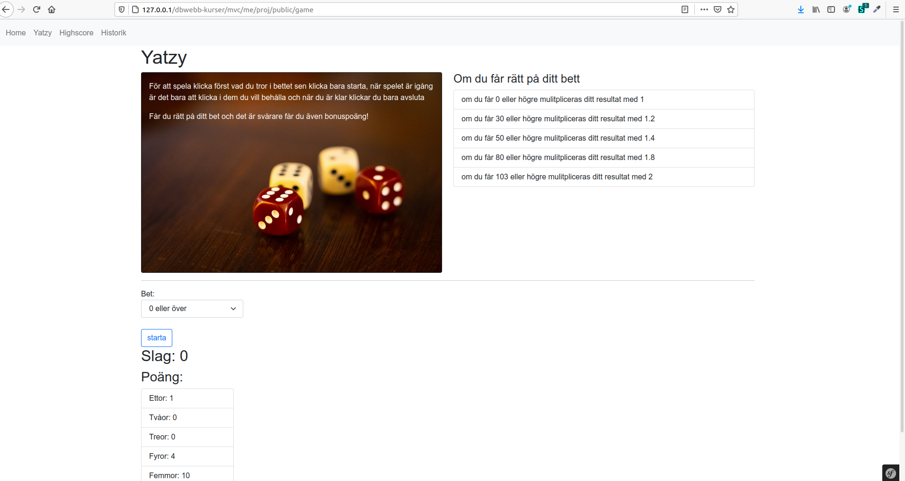
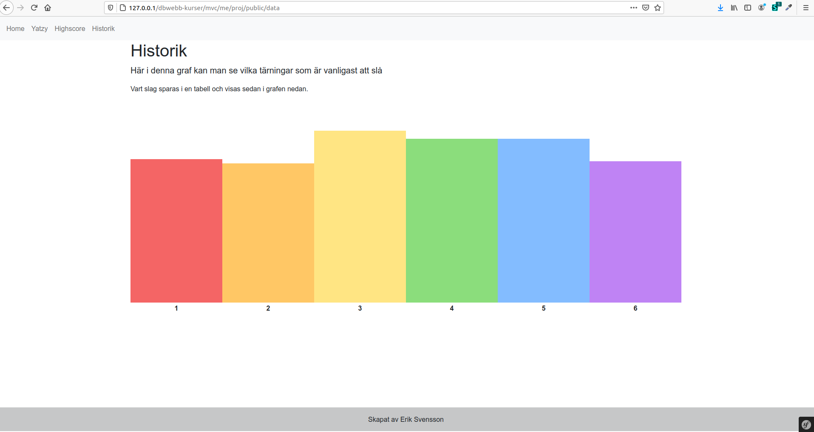
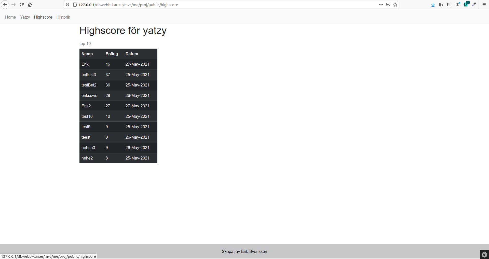
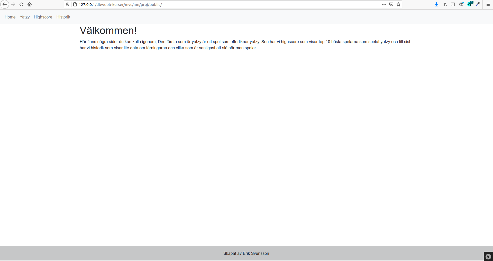

# mvc-projekt

__Scrutinizer__
 

__Travis__
 

__Requirements__

php: >=7.2.5

ext-ctype: *,

ext-iconv: *,

__Installation__
1. composer install
2. php bin/console doctrine:database:create

__General__

This project was created by me (Erik) as a final task for one of my courses,
This project is built on php with symfony as a framework with Doctrine as help for
the sqlite data. If you would like to change something with the game it self you would
look in /src/Yatzy/YatzyGame where all the functions are, The controllers for all the pages
is in src/Controller where you can find controllers for all the pages. If you would like to
change the looks or how the pages is laid out you would go to /templates where all the twig
files are, also the styling that is small and not very much used as this project is mostly
designed using bootstrap you can find in /public/style. Images is in the same folder exept
that the subfolder is instead /img.

__Images from the project__

